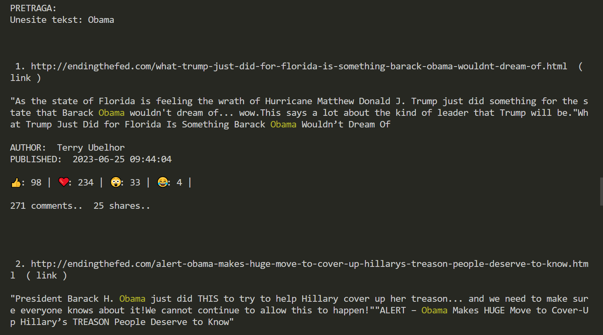
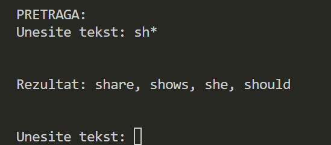

AUTHOR: Tamara Cvjetković
# 

# Name of the project
EdgeRank: simulator of algorithm EdgeRank
# 

# INFORMATIONS ABOUT THE AUTHOR
- NAME: Tamara Cvjetković
- STUDENT INDEX: sv48-2022
- FACULTY: Faculty of Technical Science, Novi Sad
- STUDIES: Software Engineering and Information Technologies 
- ACADEMIC DEGREE: Bachelor with Honours in Software Engineering
  
- CONTACT: c.tamara02@gmail.com || cvjetkovic.sv48.2022@uns.ac.rs
- PHONE: +38165 4468 114 (Serbia) || +38766 868 639 (BiH)
# 

# Project description
Project from subject named "Algorithms and Data Structures"
FTN SIIT, 2nd semester, Novi Sad, 2023.

EdgeRank is a console application in Python simulating the EdgeRank algorithm developed by Facebook, which calculates the score for all posts depending on the currently logged-in user. Trie structure was utilized for optimized searching, serialization, and deserialization, enhancing efficiency in post retrieval and display. *The data was not commited (>150MB)
# 

# For the development of the application, the following tools were utilized:
- Python
# 

# Visual design:

# 

# Functionalities:
Every logged-in user can see their top 10 posts with the highest score in their "feed". Option search was implemented, which offers three ways of searching: one or more words, whole phrase or autocomplete of words.
#

# How to start the application:
After downloading all files, you can open the project in Python IDE and run "main.py".
#

# How to use
After logging in with name and surname, of the person, their feed will show up on console, after which you can type in search. The search is case-insensitive and there are three options of searching:
1) word/words - type in one word (e.g. "will" or "Obama") or more words (e.g. "should will I as"). You will get top 10 posts ranked by score and number of words in them.
2) phrases - you can type whole phrases, e.g. "Obama will do" and you will get posts that only contain the whole phrase in them.
3) autocomplete - this action doesn't return posts, but autocompleted words that are popular (e.g. "wi*" will return "will, with, win..." depending on the popularity of the words)
#
